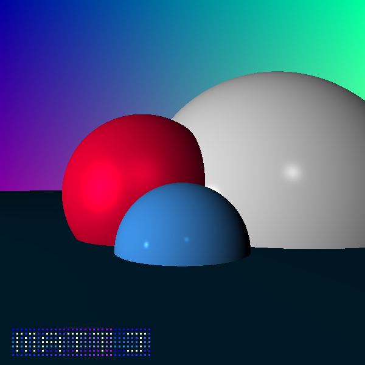

# tinyray
A simple raytracer in exactly 450 lines of C

### Features
 * Sphere-Ray Intersection
 * Materials
 * Diffuse and Specular Lighting
 * Point, Directional, and Ambient Lights
 * Custom Floating-Point Vector Library
 * Output to image with stb_image
 * Gradient Background
 * Watermark

### Helpful Resources
I created this toy raytracer to learn about basic raytracing (and for fun, of course), taking inspiration from the following resources:
 - [Gabriel Gambetta: Computer Graphics From Scratch](https://www.gabrielgambetta.com/computer-graphics-from-scratch/basic-ray-tracing.html)
 - [Scratch A Pixel: Minimal Ray Tracing](https://www.scratchapixel.com/lessons/3d-basic-rendering/minimal-ray-tracer-rendering-simple-shapes/ray-sphere-intersection)
 - [ssloy's tinyraytracer](https://github.com/ssloy/tinyraytracer)

The first link is especially helpful in understanding how raytracing works from a mathematical perspective.

**I created this for fun for the UoA ENGGEN 131 Art Challenge**
